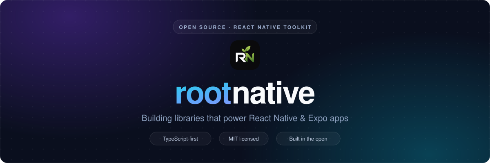
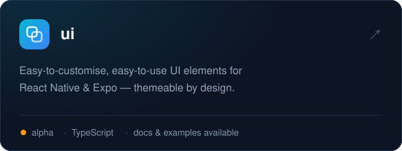
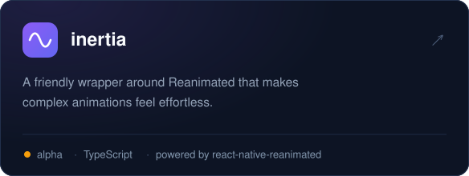
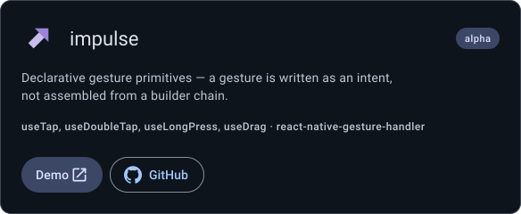
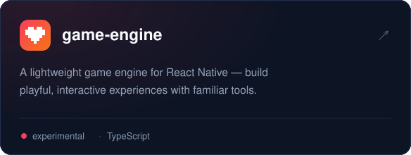
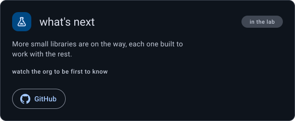

<!--
  This file is mirrored to rootnative/.github → profile/README.md (the org front page).
  The mirror copy uses absolute raw.githubusercontent.com asset URLs (it lives in a
  different repo); this copy uses relative paths. When you edit one, sync the other.
-->

<picture>
  <source media="(prefers-color-scheme: dark)" srcset="https://readme-typing-svg.demolab.com/?font=JetBrains+Mono&weight=500&size=16&duration=3200&pause=1000&center=true&vCenter=true&width=700&height=48&color=94A3B8&lines=UI+components+that+are+easy+to+customise;Animations+without+the+boilerplate;Gestures+written+as+an+intent;A+lightweight+game+engine+for+React+Native;TypeScript-first+%E2%80%A2+Open+source+%E2%80%A2+MIT">
  
</picture>

&#160;

&#160;

  

&#160;&#160;&#160;

  

<b><a href="https://rootnative.github.io/ui/">ui docs</a></b>&nbsp;&nbsp;·&nbsp;&nbsp;<b><a href="https://rootnative.github.io/inertia/">inertia docs</a></b>&nbsp;&nbsp;·&nbsp;&nbsp;<b><a href="https://rootnative.github.io/impulse/">impulse docs</a></b>&nbsp;&nbsp;·&nbsp;&nbsp;<b><a href="https://github.com/rootnative/ui-example">examples</a></b>&nbsp;&nbsp;·&nbsp;&nbsp;<b><a href="https://github.com/orgs/rootnative/repositories">all repositories</a></b>

  

Everything here is early-stage and evolving fast — ⭐ stars and feedback shape what gets built next.

